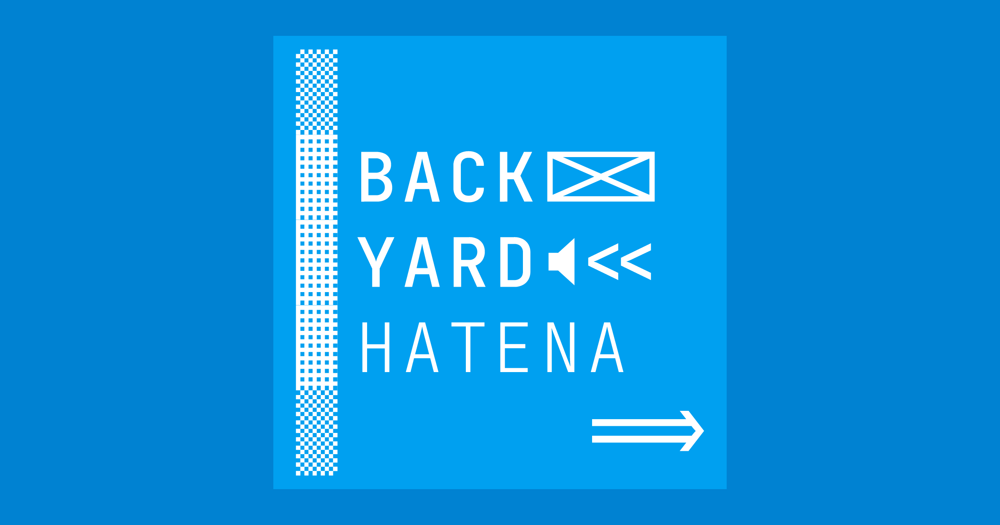

# sudofox/backyard-hatena-podcast-archive

This is an archive of episodes of the Backyard Hatena podcast, including transcripts for each. It looks like I might end up paying to have them machine-transcribed. Don't really have the cash for that atm though.

Once that's done, I would greatly appreciate anyone who wishes to correct the transcriptions including accurate timestamps and speaker names.

## Why?

- Entirely for personal/archival reasons
- I'd like to be able to enjoy the podcasts, but I am still struggling somewhat to understand spoken Japanese.
  - I just hit 460 days on Duolingo...at least I can read a bit of it.
- Also, there doesn't seem to be any transcriptions online that I can find
- Another feather in my cap for my ongoing efforts to learn every single thing about Hatena that I possibly can.
